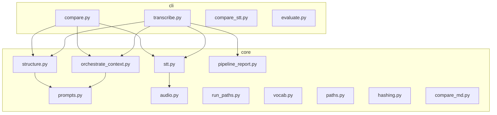
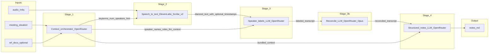
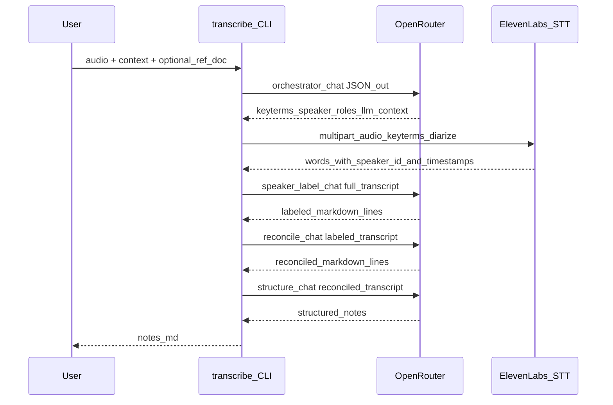
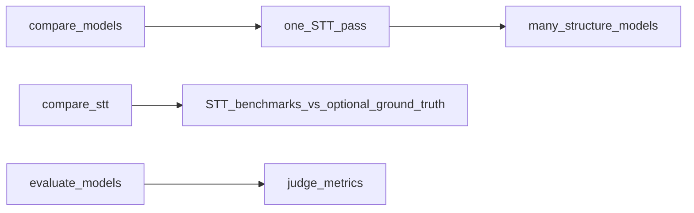

# meeting-transcribe — architecture

Python package: **`meeting_transcribe`** (`pip install -e .`). Entry points are console scripts defined in [`pyproject.toml`](../pyproject.toml).

## Package layout

## Main pipeline (`transcribe` CLI)

Default path when `--context` is set: **orchestrator → STT → speaker labels → reconciled transcript (Opus) → structured notes**. Reference docs (`--ref-doc`) feed the orchestrator only (jargon / entities), not as the transcript of *this* recording. Skip reconciliation with `--no-reconcile` (structured notes then use the labeled transcript).

### Data passed between stages (conceptual)

| Stage | Produces | Consumed downstream |
|-------|----------|---------------------|
| Orchestrator | `keyterms`, `speaker_names`, `speaker_roles`, `llm_context` | STT (keyterms + `num_speakers`); speaker + reconcile + structure LLMs (full **meeting situation + participants + jargon** bundle via `format_downstream_llm_context`) |
| STT | `[speaker_id] [H:MM:SS-H:MM:SS]?` lines, word timings in API response | Speaker-label prompt |
| Speaker labels | `Name: [span] …` (same words, resolved names) | Reconcile prompt (unless `--no-reconcile`) |
| Reconcile | Same format; splits mis-merged long lines using roles + dialogue | Structured notes prompt; `notes.md` **Reconciled transcript** section |
| Structured notes | Markdown sections (summary, actions, decisions) | `notes.md` |

## Sequence (external services)

## Chunking and limits

- **ElevenLabs (default STT):** whole file in one request; lines may include **segment time spans** when the API returns `start` / `end` per word ([`stt.py`](../src/meeting_transcribe/core/stt.py)).
- **OpenAI STT path (non-default):** long files may be **chunked** via [`audio.chunk_audio`](../src/meeting_transcribe/core/audio.py) when over size/duration caps in [`stt.transcribe`](../src/meeting_transcribe/core/stt.py).
- **Speaker labels / structure LLMs:** `max_tokens` and **`finish_reason`** handling are in [`structure.py`](../src/meeting_transcribe/core/structure.py) and [`config.py`](../src/meeting_transcribe/core/config.py); truncation should **fail fast** rather than silently cut.

## Other CLIs

- **`compare-models`:** one transcript, several structuring models → `compare.md`.
- **`compare-stt`:** STT comparison / evaluation helpers (see module docstrings).
- **`evaluate-models`:** model evaluation flow (ground truth under test harness paths only).

## Configuration touchpoints

| File | Role |
|------|------|
| [`config.py`](../src/meeting_transcribe/core/config.py) | Default STT/OpenRouter/orchestrator models, cost rates, `SPEAKER_LABEL_MAX_TOKENS`, `STRUCTURE_NOTES_MAX_TOKENS` |
| [`prompts.py`](../src/meeting_transcribe/core/prompts.py) | System/user templates for structure + speaker labeling + optional correction |
| [`orchestrate_context.py`](../src/meeting_transcribe/core/orchestrate_context.py) | Orchestrator JSON schema, pipeline contract text, `format_downstream_llm_context` |

## Related docs

- Benchmark-oriented notes (older stage naming in places): [`PIPELINE_INSIGHTS.md`](PIPELINE_INSIGHTS.md)
