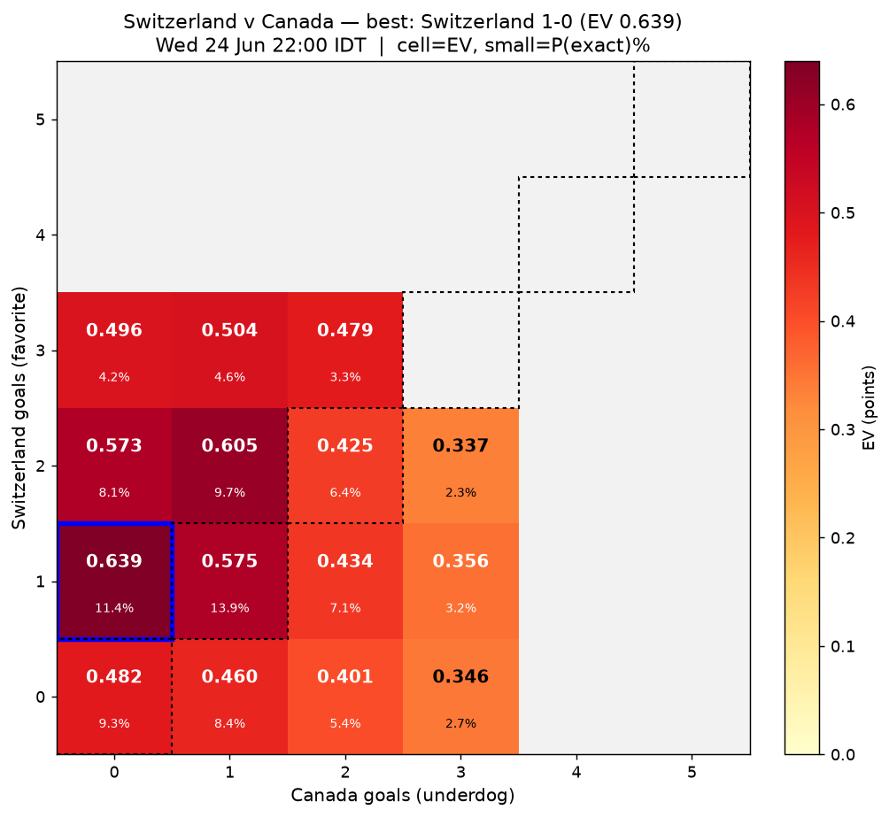
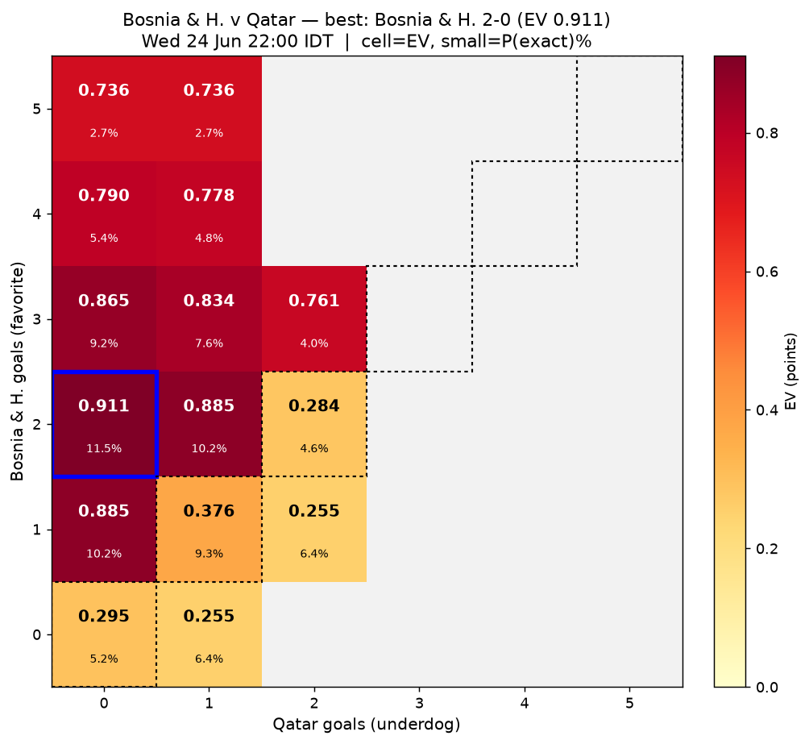
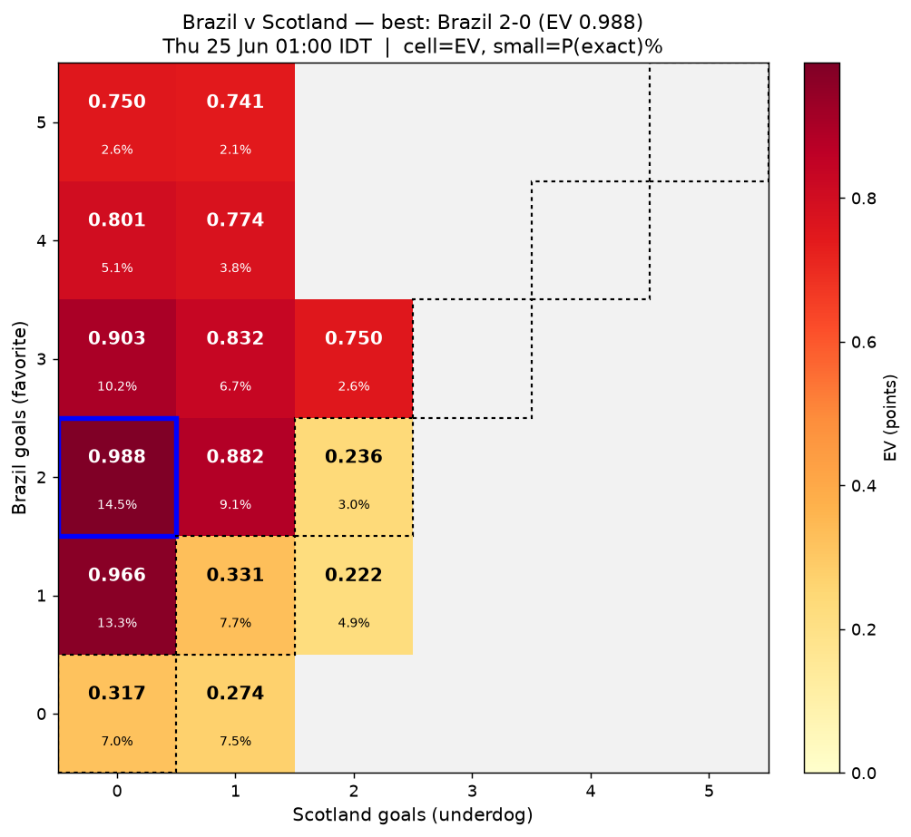
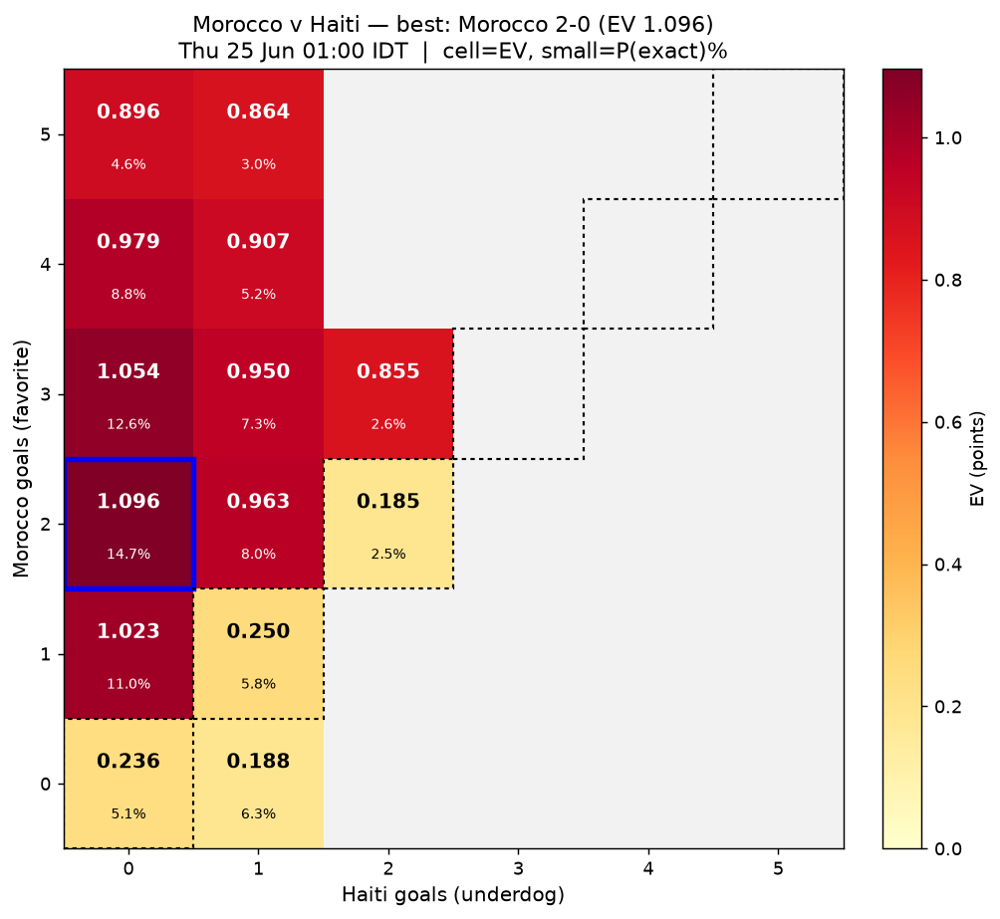
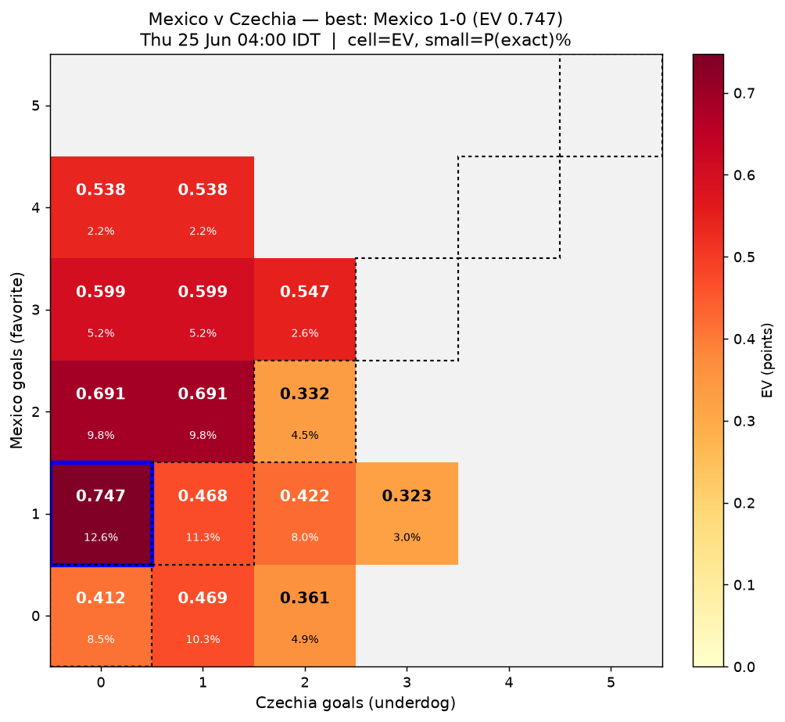
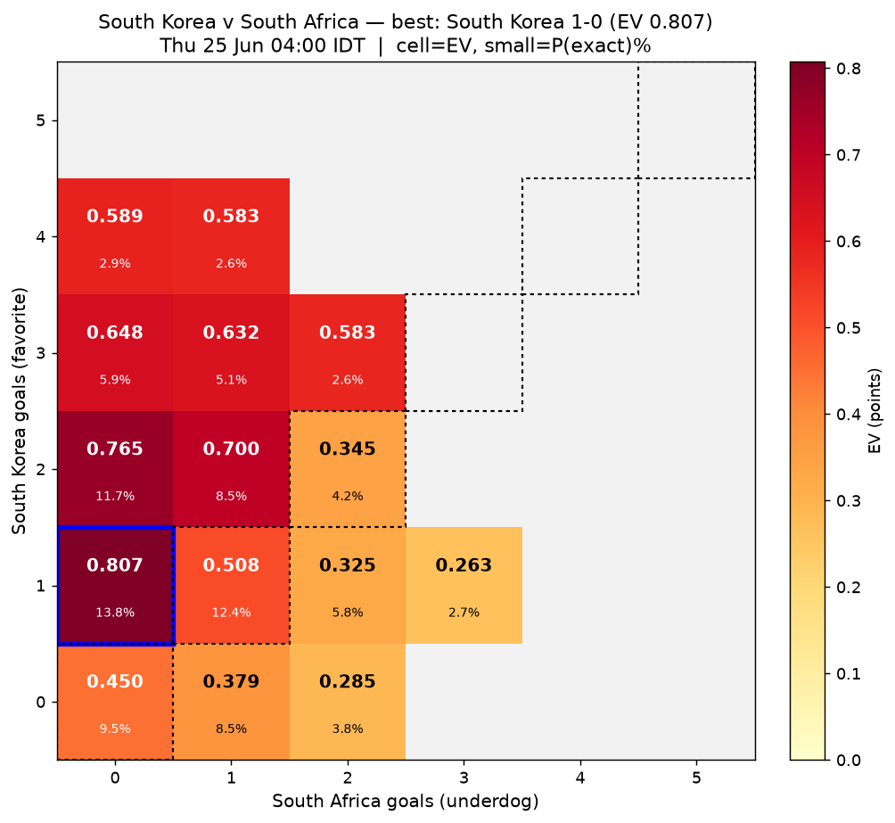
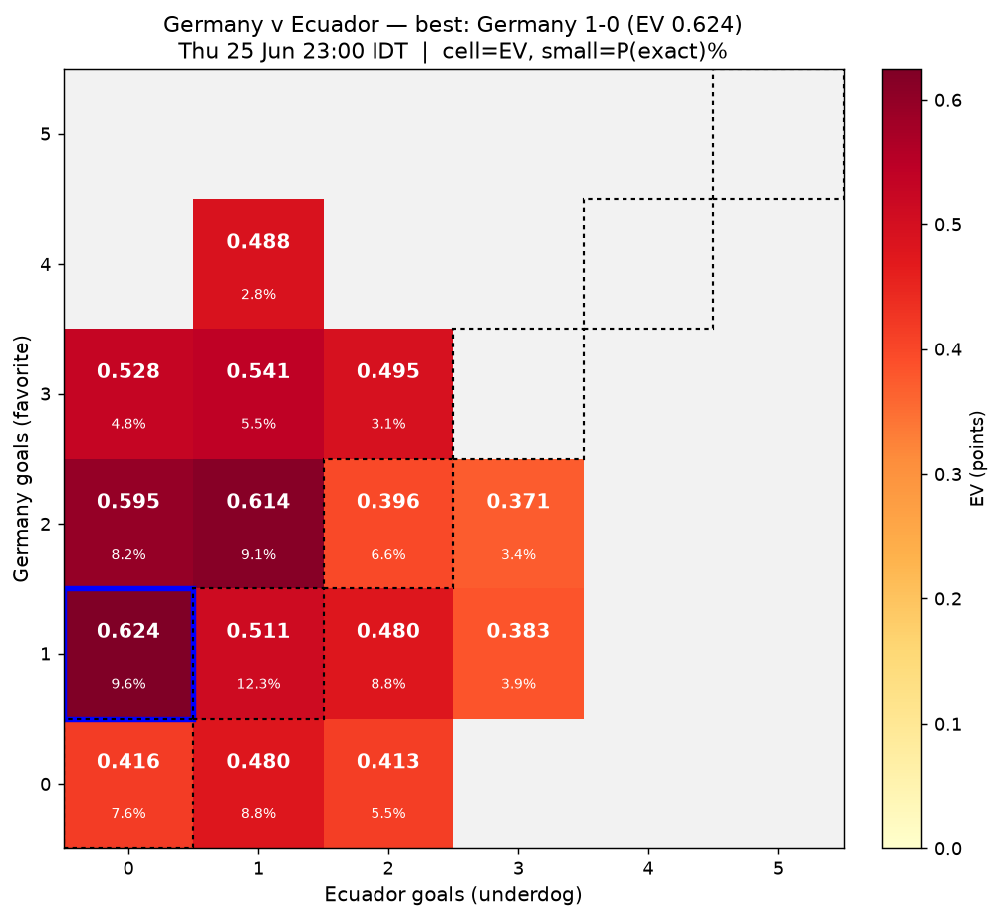
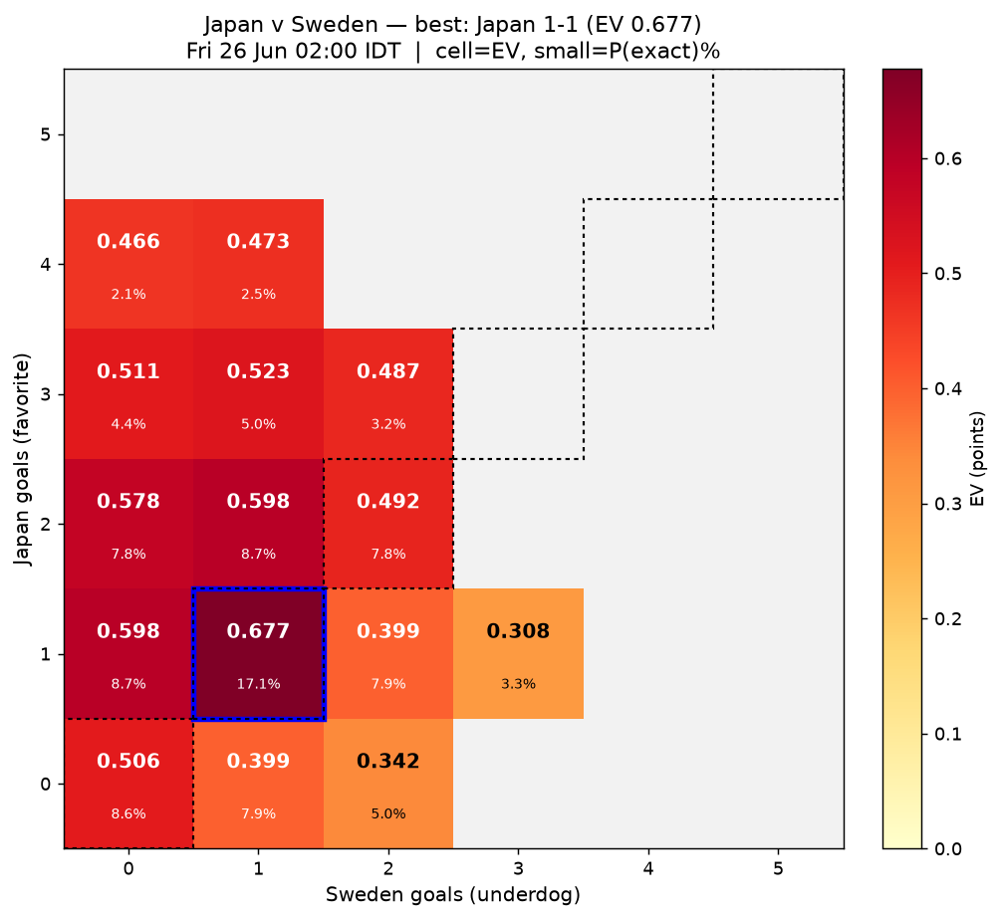
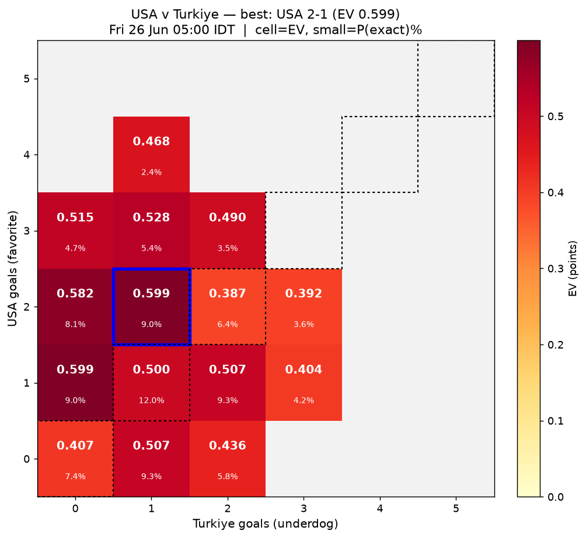
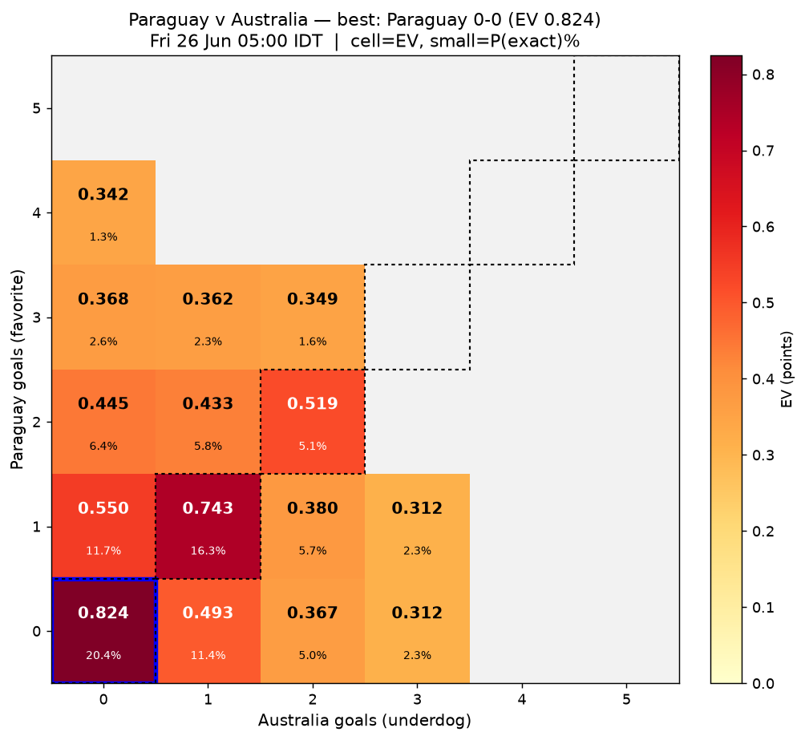

# World Cup 2026 — EV correct-score picks (bet365 via kickoff.co.uk)

Window: 48h from **2026-06-24 07:01 IDT**. All group stage (dir 1pt / exact 3pt; EV = P(class) + 2·P(exact)).
Correct-score de-vigged within outcome class from listed scorelines only (bet365 omits a small 'any other score' tail — minor caveat).

## Switzerland v Canada — Wed 24 Jun 22:00 IDT
De-vig 1X2: Switzerland 41.2% / Draw 29.6% / Canada 29.2%  → **favorite: Switzerland** (41.2%)

| # | Scoreline (Fav-Dog) | P(exact) | EV |
|---|---|---|---|
| 1 | Switzerland 1-0 | 11.4% | 0.639 |
| 2 | Switzerland 2-1 | 9.7% | 0.605 |
| 3 | Switzerland 1-1 | 13.9% | 0.575 |
| 4 | Switzerland 2-0 | 8.1% | 0.573 |
| 5 | Switzerland 3-1 | 4.6% | 0.504 |
| 6 | Switzerland 3-0 | 4.2% | 0.496 |

**Best pick: Switzerland 1-0** (EV 0.639, P 11.4%). 
Best DRAW for contrast: 1-1 (EV 0.575, P 13.9%).

## Bosnia & H. v Qatar — Wed 24 Jun 22:00 IDT
De-vig 1X2: Bosnia & H. 68.2% / Draw 19.1% / Qatar 12.7%  → **favorite: Bosnia & H.** (68.2%)

| # | Scoreline (Fav-Dog) | P(exact) | EV |
|---|---|---|---|
| 1 | Bosnia & H. 2-0 | 11.5% | 0.911 |
| 2 | Bosnia & H. 2-1 | 10.2% | 0.885 |
| 3 | Bosnia & H. 1-0 | 10.2% | 0.885 |
| 4 | Bosnia & H. 3-0 | 9.2% | 0.865 |
| 5 | Bosnia & H. 3-1 | 7.6% | 0.834 |
| 6 | Bosnia & H. 4-0 | 5.4% | 0.790 |

**Best pick: Bosnia & H. 2-0** (EV 0.911, P 11.5%). 
Best DRAW for contrast: 1-1 (EV 0.376, P 9.3%).

## Scotland v Brazil — Thu 25 Jun 01:00 IDT
De-vig 1X2: Scotland 12.4% / Draw 17.7% / Brazil 69.9%  → **favorite: Brazil** (69.9%)

| # | Scoreline (Fav-Dog) | P(exact) | EV |
|---|---|---|---|
| 1 | Brazil 2-0 | 14.5% | 0.988 |
| 2 | Brazil 1-0 | 13.3% | 0.966 |
| 3 | Brazil 3-0 | 10.2% | 0.903 |
| 4 | Brazil 2-1 | 9.1% | 0.882 |
| 5 | Brazil 3-1 | 6.7% | 0.832 |
| 6 | Brazil 4-0 | 5.1% | 0.801 |

**Best pick: Brazil 2-0** (EV 0.988, P 14.5%). 
Best DRAW for contrast: 1-1 (EV 0.331, P 7.7%).

## Morocco v Haiti — Thu 25 Jun 01:00 IDT
De-vig 1X2: Morocco 80.3% / Draw 13.4% / Haiti 6.3%  → **favorite: Morocco** (80.3%)

| # | Scoreline (Fav-Dog) | P(exact) | EV |
|---|---|---|---|
| 1 | Morocco 2-0 | 14.7% | 1.096 |
| 2 | Morocco 3-0 | 12.6% | 1.054 |
| 3 | Morocco 1-0 | 11.0% | 1.023 |
| 4 | Morocco 4-0 | 8.8% | 0.979 |
| 5 | Morocco 2-1 | 8.0% | 0.963 |
| 6 | Morocco 3-1 | 7.3% | 0.950 |

**Best pick: Morocco 2-0** (EV 1.096, P 14.7%). 
Best DRAW for contrast: 1-1 (EV 0.250, P 5.8%).

## Czechia v Mexico — Thu 25 Jun 04:00 IDT
De-vig 1X2: Czechia 26.3% / Draw 24.2% / Mexico 49.5%  → **favorite: Mexico** (49.5%)

| # | Scoreline (Fav-Dog) | P(exact) | EV |
|---|---|---|---|
| 1 | Mexico 1-0 | 12.6% | 0.747 |
| 2 | Mexico 2-0 | 9.8% | 0.691 |
| 3 | Mexico 2-1 | 9.8% | 0.691 |
| 4 | Mexico 3-0 | 5.2% | 0.599 |
| 5 | Mexico 3-1 | 5.2% | 0.599 |
| 6 | Mexico 3-2 | 2.6% | 0.547 |

**Best pick: Mexico 1-0** (EV 0.747, P 12.6%). 
Best DRAW for contrast: 1-1 (EV 0.468, P 11.3%).

## South Africa v South Korea — Thu 25 Jun 04:00 IDT
De-vig 1X2: South Africa 20.9% / Draw 26.1% / South Korea 53.1%  → **favorite: South Korea** (53.1%)

| # | Scoreline (Fav-Dog) | P(exact) | EV |
|---|---|---|---|
| 1 | South Korea 1-0 | 13.8% | 0.807 |
| 2 | South Korea 2-0 | 11.7% | 0.765 |
| 3 | South Korea 2-1 | 8.5% | 0.700 |
| 4 | South Korea 3-0 | 5.9% | 0.648 |
| 5 | South Korea 3-1 | 5.1% | 0.632 |
| 6 | South Korea 4-0 | 2.9% | 0.589 |

**Best pick: South Korea 1-0** (EV 0.807, P 13.8%). 
Best DRAW for contrast: 1-1 (EV 0.508, P 12.4%).

## Ecuador v Germany — Thu 25 Jun 23:00 IDT
De-vig 1X2: Ecuador 30.4% / Draw 26.5% / Germany 43.2%  → **favorite: Germany** (43.2%)

| # | Scoreline (Fav-Dog) | P(exact) | EV |
|---|---|---|---|
| 1 | Germany 1-0 | 9.6% | 0.624 |
| 2 | Germany 2-1 | 9.1% | 0.614 |
| 3 | Germany 2-0 | 8.2% | 0.595 |
| 4 | Germany 3-1 | 5.5% | 0.541 |
| 5 | Germany 3-0 | 4.8% | 0.528 |
| 6 | Germany 1-1 | 12.3% | 0.511 |

**Best pick: Germany 1-0** (EV 0.624, P 9.6%). 
Best DRAW for contrast: 1-1 (EV 0.511, P 12.3%).

## Curacao v Cote d'Ivoire — Thu 25 Jun 23:00 IDT
De-vig 1X2: Curacao 5.7% / Draw 12.0% / Cote d'Ivoire 82.3%  → **favorite: Cote d'Ivoire** (82.3%)

| # | Scoreline (Fav-Dog) | P(exact) | EV |
|---|---|---|---|
| 1 | Cote d'Ivoire 2-0 | 14.8% | 1.119 |
| 2 | Cote d'Ivoire 3-0 | 13.6% | 1.096 |
| 3 | Cote d'Ivoire 1-0 | 10.4% | 1.032 |
| 4 | Cote d'Ivoire 4-0 | 9.3% | 1.010 |
| 5 | Cote d'Ivoire 2-1 | 8.1% | 0.985 |
| 6 | Cote d'Ivoire 3-1 | 7.4% | 0.971 |

**Best pick: Cote d'Ivoire 2-0** (EV 1.119, P 14.8%). 
Best DRAW for contrast: 1-1 (EV 0.223, P 5.2%).

## Japan v Sweden — Fri 26 Jun 02:00 IDT
De-vig 1X2: Japan 42.3% / Draw 33.5% / Sweden 24.2%  → **favorite: Japan** (42.3%)

| # | Scoreline (Fav-Dog) | P(exact) | EV |
|---|---|---|---|
| 1 | Japan 1-1 | 17.1% | 0.677 |
| 2 | Japan 2-1 | 8.7% | 0.598 |
| 3 | Japan 1-0 | 8.7% | 0.598 |
| 4 | Japan 2-0 | 7.8% | 0.578 |
| 5 | Japan 3-1 | 5.0% | 0.523 |
| 6 | Japan 3-0 | 4.4% | 0.511 |

**Best pick: Japan 1-1** (EV 0.677, P 17.1%). 
Best DRAW for contrast: 1-1 (EV 0.677, P 17.1%).

## Tunisia v Netherlands — Fri 26 Jun 02:00 IDT
De-vig 1X2: Tunisia 4.3% / Draw 11.8% / Netherlands 83.8%  → **favorite: Netherlands** (83.8%)

| # | Scoreline (Fav-Dog) | P(exact) | EV |
|---|---|---|---|
| 1 | Netherlands 2-0 | 14.9% | 1.137 |
| 2 | Netherlands 3-0 | 13.8% | 1.114 |
| 3 | Netherlands 4-0 | 10.5% | 1.049 |
| 4 | Netherlands 1-0 | 10.0% | 1.037 |
| 5 | Netherlands 2-1 | 7.5% | 0.988 |
| 6 | Netherlands 3-1 | 6.9% | 0.976 |

**Best pick: Netherlands 2-0** (EV 1.137, P 14.9%). 
Best DRAW for contrast: 1-1 (EV 0.224, P 5.3%).

## Turkiye v USA — Fri 26 Jun 05:00 IDT
De-vig 1X2: Turkiye 32.1% / Draw 25.9% / USA 42.0%  → **favorite: USA** (42.0%)

| # | Scoreline (Fav-Dog) | P(exact) | EV |
|---|---|---|---|
| 1 | USA 2-1 | 9.0% | 0.599 |
| 2 | USA 1-0 | 9.0% | 0.599 |
| 3 | USA 2-0 | 8.1% | 0.582 |
| 4 | USA 3-1 | 5.4% | 0.528 |
| 5 | USA 3-0 | 4.7% | 0.515 |
| 6 | USA 1-2 | 9.3% | 0.507 |

**Best pick: USA 2-1** (EV 0.599, P 9.0%). 
Best DRAW for contrast: 1-1 (EV 0.500, P 12.0%).

## Paraguay v Australia — Fri 26 Jun 05:00 IDT
De-vig 1X2: Paraguay 31.7% / Draw 41.7% / Australia 26.6%  → **favorite: Paraguay** (31.7%)

| # | Scoreline (Fav-Dog) | P(exact) | EV |
|---|---|---|---|
| 1 | Paraguay 0-0 | 20.4% | 0.824 |
| 2 | Paraguay 1-1 | 16.3% | 0.743 |
| 3 | Paraguay 1-0 | 11.7% | 0.550 |
| 4 | Paraguay 2-2 | 5.1% | 0.519 |
| 5 | Paraguay 0-1 | 11.4% | 0.493 |
| 6 | Paraguay 2-0 | 6.4% | 0.445 |

**Best pick: Paraguay 0-0** (EV 0.824, P 20.4%). 
Best DRAW for contrast: 0-0 (EV 0.824, P 20.4%).

## Summary — best pick per match

| Match | KO (IDT) | Favorite | Best pick | EV | P(exact) |
|---|---|---|---|---|---|
| Tunisia v Netherlands | Fri 26 Jun 02:00 | Netherlands | Netherlands 2-0 | 1.137 | 14.9% |
| Curacao v Cote d'Ivoire | Thu 25 Jun 23:00 | Cote d'Ivoire | Cote d'Ivoire 2-0 | 1.119 | 14.8% |
| Morocco v Haiti | Thu 25 Jun 01:00 | Morocco | Morocco 2-0 | 1.096 | 14.7% |
| Scotland v Brazil | Thu 25 Jun 01:00 | Brazil | Brazil 2-0 | 0.988 | 14.5% |
| Bosnia & H. v Qatar | Wed 24 Jun 22:00 | Bosnia & H. | Bosnia & H. 2-0 | 0.911 | 11.5% |
| Paraguay v Australia | Fri 26 Jun 05:00 | Paraguay | Paraguay 0-0 | 0.824 | 20.4% |
| South Africa v South Korea | Thu 25 Jun 04:00 | South Korea | South Korea 1-0 | 0.807 | 13.8% |
| Czechia v Mexico | Thu 25 Jun 04:00 | Mexico | Mexico 1-0 | 0.747 | 12.6% |
| Japan v Sweden | Fri 26 Jun 02:00 | Japan | Japan 1-1 | 0.677 | 17.1% |
| Switzerland v Canada | Wed 24 Jun 22:00 | Switzerland | Switzerland 1-0 | 0.639 | 11.4% |
| Ecuador v Germany | Thu 25 Jun 23:00 | Germany | Germany 1-0 | 0.624 | 9.6% |
| Turkiye v USA | Fri 26 Jun 05:00 | USA | USA 2-1 | 0.599 | 9.0% |
