# WC2026 EV picks — 2026-06-26 (IDT, 48h window)

12 upcoming group-stage matches in the next 48h (kickoffs Fri Jun 26 22:00 IDT → Sun Jun 28 05:00 IDT). bet365 odds via kickoff.co.uk, de-vigged.

**Scoring (group):** direction 1 pt, exact 3 pts → EV = P(class) + 2·P(exact).

**Caveat:** bet365 correct-score list is partial (~15 lines, no 'any other score' bucket); de-vigged WITHIN each outcome class from scorelines listed.

## Norway v France — group · KO 22:00 IDT Fri Jun 26

De-vigged 1X2: Norway **18.9%** · Draw **21.0%** · France **60.1%**. Favorite: **France** (win 60.1%).

| Scoreline (fav-dog) | P(exact) | EV |
|---|---|---|
| France 2-1 | 10.91% | 0.820 |
| France 1-0 | 10.30% | 0.807 |
| France 2-0 | 10.30% | 0.807 |
| France 3-0 | 7.13% | 0.744 |
| France 3-1 | 7.13% | 0.744 |
| France 3-2 | 4.03% | 0.682 |

**Best pick:** France 2-1 — EV 0.820 (P 10.91%)  
**Best draw (contrast):** 1-1 — EV 0.407 (P 9.85%)  
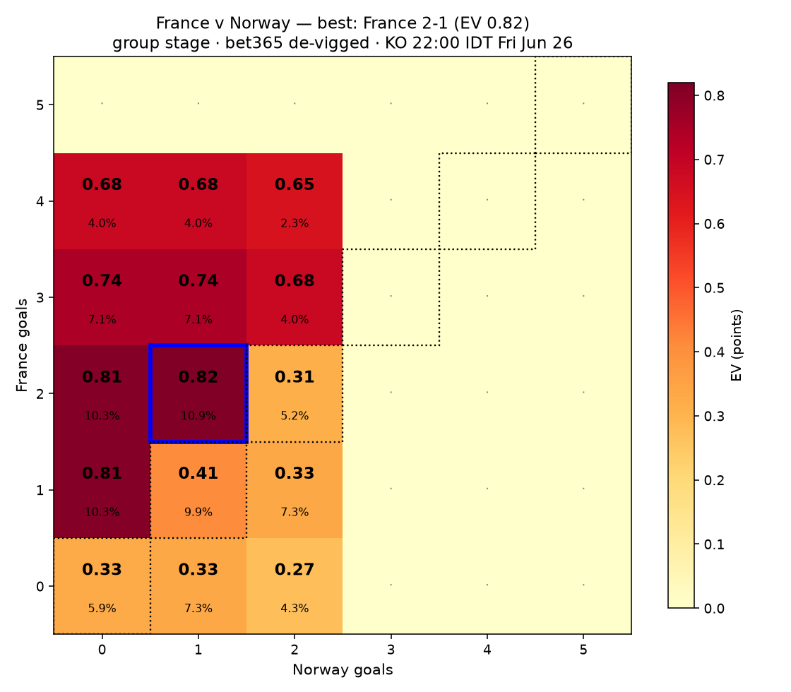

## Senegal v Iraq — group · KO 22:00 IDT Fri Jun 26

De-vigged 1X2: Senegal **78.0%** · Draw **14.7%** · Iraq **7.3%**. Favorite: **Senegal** (win 78.0%).

| Scoreline (fav-dog) | P(exact) | EV |
|---|---|---|
| Senegal 2-0 | 14.24% | 1.065 |
| Senegal 3-0 | 12.34% | 1.027 |
| Senegal 1-0 | 11.57% | 1.011 |
| Senegal 2-1 | 9.25% | 0.965 |
| Senegal 3-1 | 7.71% | 0.934 |
| Senegal 4-0 | 7.71% | 0.934 |

**Best pick:** Senegal 2-0 — EV 1.065 (P 14.24%)  
**Best draw (contrast):** 1-1 — EV 0.279 (P 6.63%)  
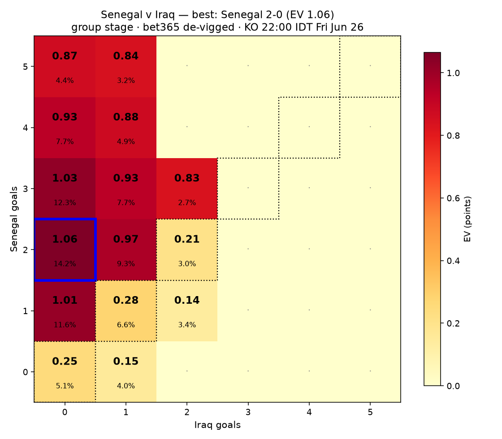

## Cape Verde v Saudi Arabia — group · KO 03:00 IDT Sat Jun 27

De-vigged 1X2: Cape Verde **36.1%** · Draw **27.9%** · Saudi Arabia **36.1%**. Favorite: **Cape Verde** (win 36.1%).

| Scoreline (fav-dog) | P(exact) | EV |
|---|---|---|
| Cape Verde 1-0 | 10.80% | 0.577 |
| Cape Verde 0-1 | 10.80% | 0.577 |
| Cape Verde 1-1 | 12.92% | 0.537 |
| Cape Verde 2-1 | 8.35% | 0.528 |
| Cape Verde 1-2 | 8.35% | 0.528 |
| Cape Verde 2-0 | 7.06% | 0.502 |

**Best pick:** Cape Verde 1-0 — EV 0.577 (P 10.80%)  
**Best draw (contrast):** 1-1 — EV 0.537 (P 12.92%)  
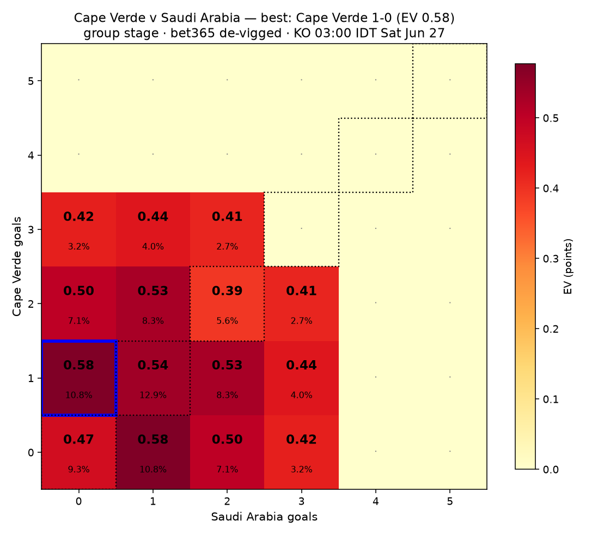

## Uruguay v Spain — group · KO 03:00 IDT Sat Jun 27

De-vigged 1X2: Uruguay **14.4%** · Draw **22.3%** · Spain **63.3%**. Favorite: **Spain** (win 63.3%).

| Scoreline (fav-dog) | P(exact) | EV |
|---|---|---|
| Spain 1-0 | 13.61% | 0.905 |
| Spain 2-0 | 12.64% | 0.886 |
| Spain 2-1 | 9.83% | 0.829 |
| Spain 3-0 | 8.04% | 0.794 |
| Spain 3-1 | 6.80% | 0.769 |
| Spain 4-0 | 4.21% | 0.717 |

**Best pick:** Spain 1-0 — EV 0.905 (P 13.61%)  
**Best draw (contrast):** 1-1 — EV 0.421 (P 9.89%)  
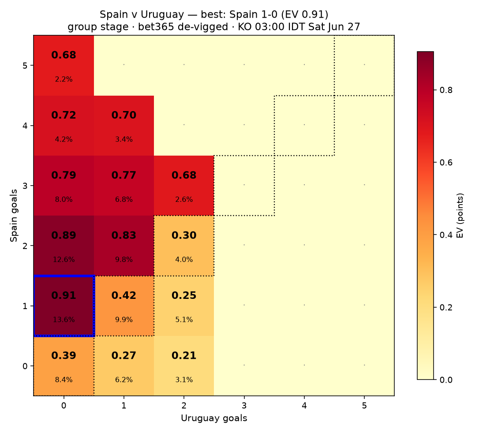

## Egypt v Iran — group · KO 06:00 IDT Sat Jun 27

De-vigged 1X2: Egypt **39.9%** · Draw **35.1%** · Iran **25.0%**. Favorite: **Egypt** (win 39.9%).

| Scoreline (fav-dog) | P(exact) | EV |
|---|---|---|
| Egypt 1-0 | 13.05% | 0.660 |
| Egypt 0-0 | 15.34% | 0.658 |
| Egypt 1-1 | 15.34% | 0.658 |
| Egypt 2-0 | 8.48% | 0.569 |
| Egypt 2-1 | 7.71% | 0.553 |
| Egypt 3-0 | 3.69% | 0.473 |

**Best pick:** Egypt 1-0 — EV 0.660 (P 13.05%)  
**Best draw (contrast):** 0-0 — EV 0.658 (P 15.34%)  
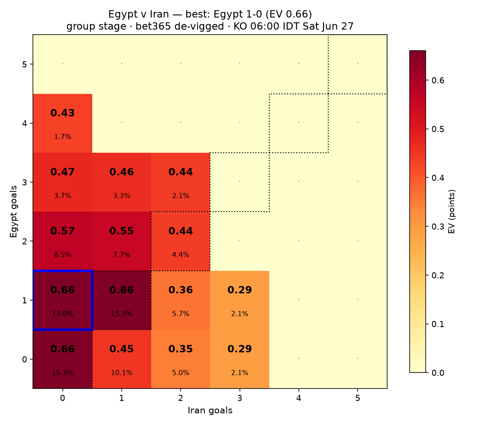

## New Zealand v Belgium — group · KO 06:00 IDT Sat Jun 27

De-vigged 1X2: New Zealand **6.2%** · Draw **12.4%** · Belgium **81.4%**. Favorite: **Belgium** (win 81.4%).

| Scoreline (fav-dog) | P(exact) | EV |
|---|---|---|
| Belgium 2-0 | 12.98% | 1.074 |
| Belgium 3-0 | 12.11% | 1.056 |
| Belgium 4-0 | 9.08% | 0.996 |
| Belgium 1-0 | 9.08% | 0.996 |
| Belgium 2-1 | 8.26% | 0.979 |
| Belgium 3-1 | 8.26% | 0.979 |

**Best pick:** Belgium 2-0 — EV 1.074 (P 12.98%)  
**Best draw (contrast):** 1-1 — EV 0.235 (P 5.56%)  

## Panama v England — group · KO 00:00 IDT Sun Jun 28

De-vigged 1X2: Panama **7.3%** · Draw **11.8%** · England **80.9%**. Favorite: **England** (win 80.9%).

| Scoreline (fav-dog) | P(exact) | EV |
|---|---|---|
| England 2-0 | 13.87% | 1.086 |
| England 3-0 | 12.88% | 1.067 |
| England 1-0 | 10.02% | 1.009 |
| England 4-0 | 9.02% | 0.989 |
| England 2-1 | 8.20% | 0.973 |
| England 3-1 | 7.51% | 0.959 |

**Best pick:** England 2-0 — EV 1.086 (P 13.87%)  
**Best draw (contrast):** 1-1 — EV 0.228 (P 5.49%)  
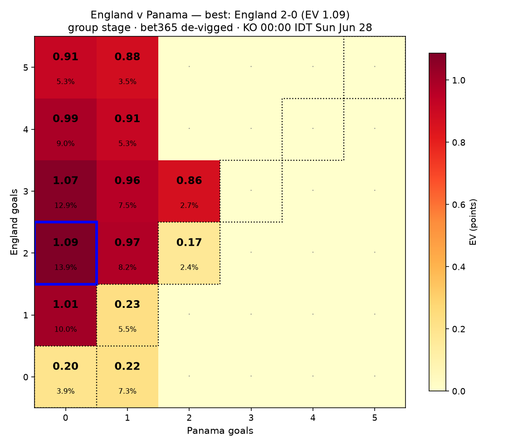

## Croatia v Ghana — group · KO 00:00 IDT Sun Jun 28

De-vigged 1X2: Croatia **54.1%** · Draw **28.7%** · Ghana **17.2%**. Favorite: **Croatia** (win 54.1%).

| Scoreline (fav-dog) | P(exact) | EV |
|---|---|---|
| Croatia 1-0 | 14.45% | 0.830 |
| Croatia 2-0 | 11.56% | 0.772 |
| Croatia 2-1 | 9.13% | 0.723 |
| Croatia 3-0 | 5.78% | 0.657 |
| Croatia 3-1 | 5.10% | 0.643 |
| Croatia 4-0 | 2.99% | 0.601 |

**Best pick:** Croatia 1-0 — EV 0.830 (P 14.45%)  
**Best draw (contrast):** 1-1 — EV 0.547 (P 12.99%)  
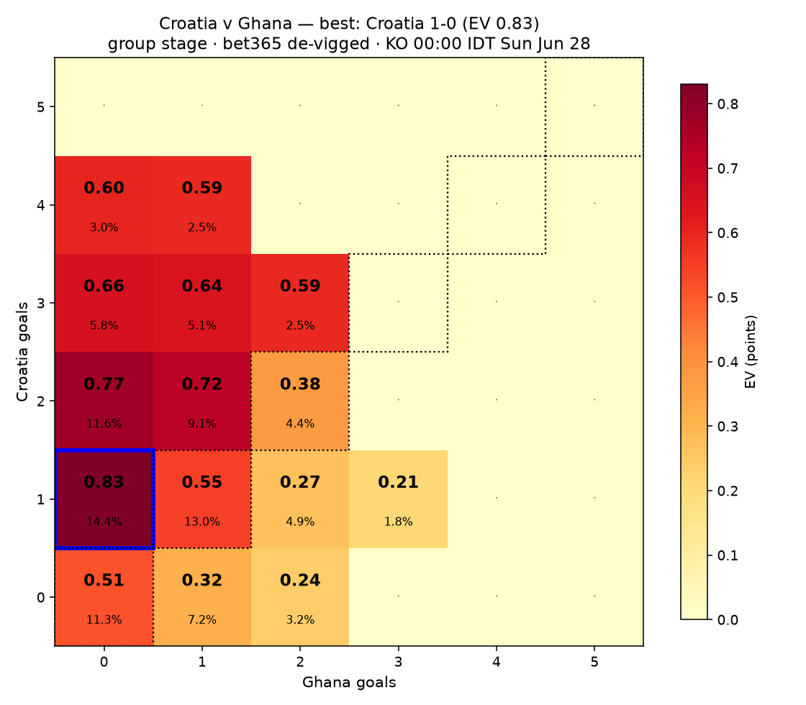

## Colombia v Portugal — group · KO 02:30 IDT Sun Jun 28

De-vigged 1X2: Colombia **21.8%** · Draw **25.6%** · Portugal **52.6%**. Favorite: **Portugal** (win 52.6%).

| Scoreline (fav-dog) | P(exact) | EV |
|---|---|---|
| Portugal 1-0 | 12.56% | 0.777 |
| Portugal 2-0 | 10.34% | 0.733 |
| Portugal 2-1 | 9.77% | 0.721 |
| Portugal 3-0 | 5.86% | 0.643 |
| Portugal 3-1 | 5.86% | 0.643 |
| Portugal 3-2 | 3.03% | 0.586 |

**Best pick:** Portugal 1-0 — EV 0.777 (P 12.56%)  
**Best draw (contrast):** 1-1 — EV 0.498 (P 12.11%)  
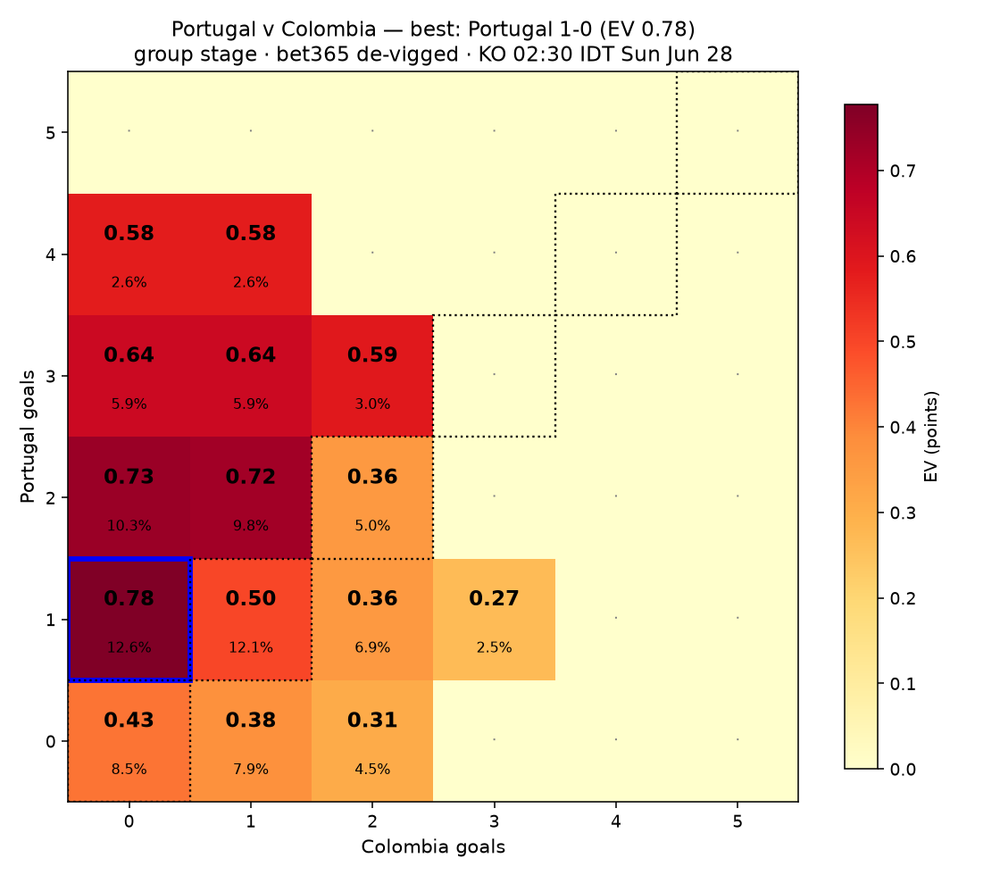

## Congo DR v Uzbekistan — group · KO 02:30 IDT Sun Jun 28

De-vigged 1X2: Congo DR **55.8%** · Draw **23.1%** · Uzbekistan **21.1%**. Favorite: **Congo DR** (win 55.8%).

| Scoreline (fav-dog) | P(exact) | EV |
|---|---|---|
| Congo DR 1-0 | 12.21% | 0.802 |
| Congo DR 2-0 | 10.78% | 0.773 |
| Congo DR 2-1 | 10.18% | 0.761 |
| Congo DR 3-0 | 7.05% | 0.699 |
| Congo DR 3-1 | 6.11% | 0.680 |
| Congo DR 4-0 | 3.16% | 0.621 |

**Best pick:** Congo DR 1-0 — EV 0.802 (P 12.21%)  
**Best draw (contrast):** 1-1 — EV 0.447 (P 10.77%)  
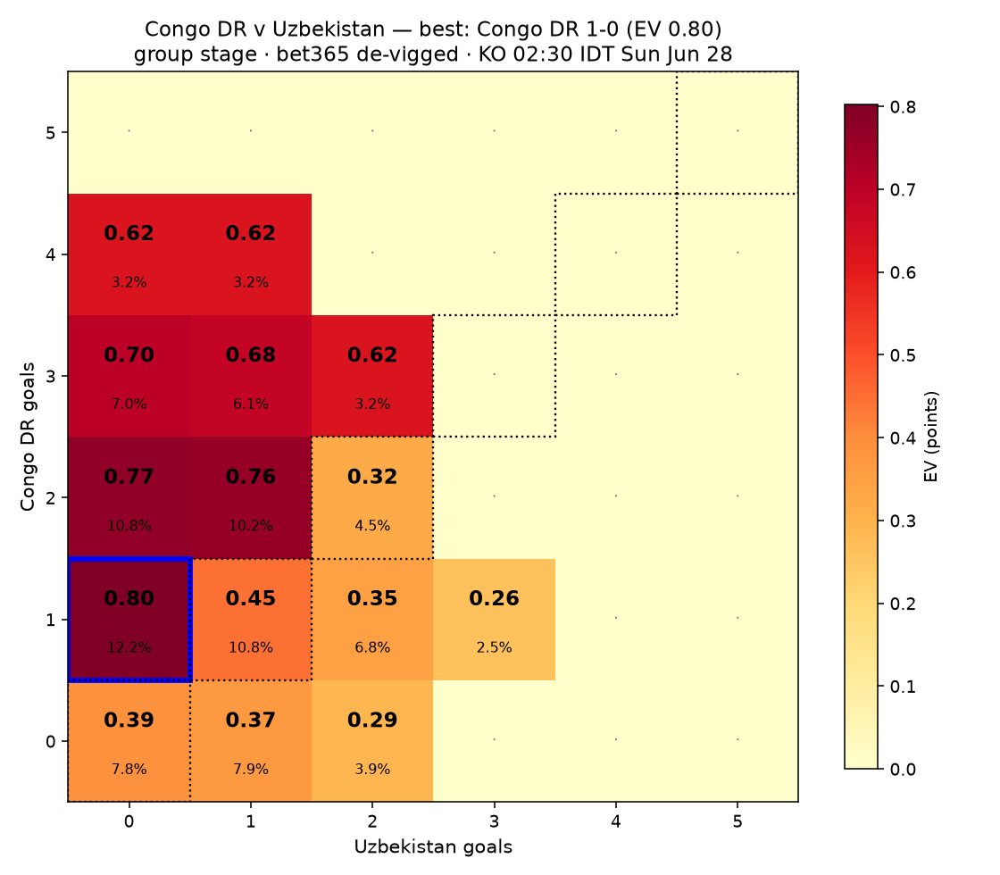

## Algeria v Austria — group · KO 05:00 IDT Sun Jun 28

De-vigged 1X2: Algeria **23.8%** · Draw **43.2%** · Austria **33.0%**. Favorite: **Austria** (win 33.0%).

| Scoreline (fav-dog) | P(exact) | EV |
|---|---|---|
| Austria 1-1 | 19.27% | 0.818 |
| Austria 0-0 | 17.52% | 0.783 |
| Austria 2-2 | 6.42% | 0.561 |
| Austria 1-0 | 11.48% | 0.560 |
| Austria 2-0 | 6.70% | 0.464 |
| Austria 2-1 | 6.70% | 0.464 |

**Best pick:** Austria 1-1 — EV 0.818 (P 19.27%)  
**Best draw (contrast):** 1-1 — EV 0.818 (P 19.27%)  
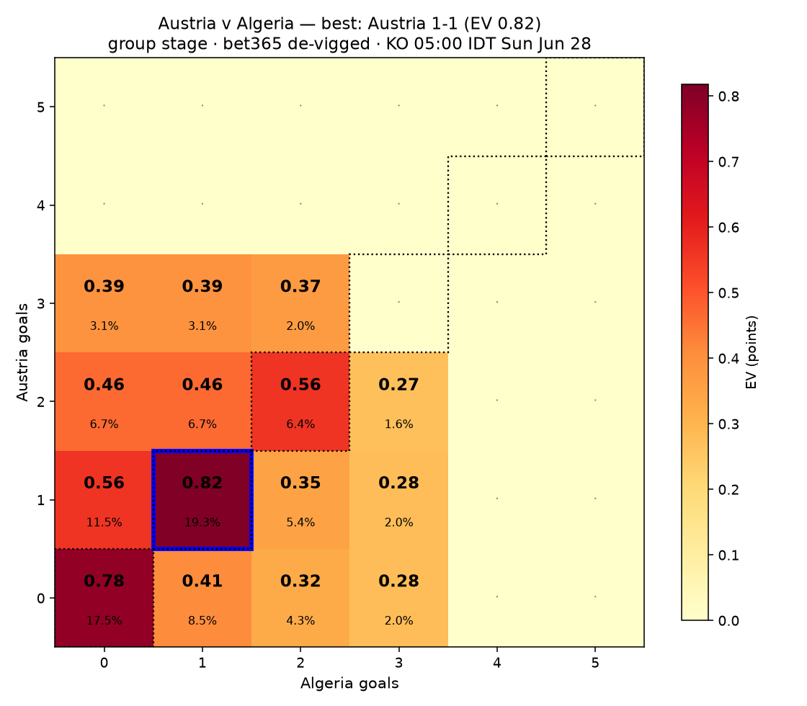

## Jordan v Argentina — group · KO 05:00 IDT Sun Jun 28

De-vigged 1X2: Jordan **6.4%** · Draw **11.9%** · Argentina **81.7%**. Favorite: **Argentina** (win 81.7%).

| Scoreline (fav-dog) | P(exact) | EV |
|---|---|---|
| Argentina 2-0 | 15.38% | 1.125 |
| Argentina 1-0 | 13.18% | 1.081 |
| Argentina 3-0 | 13.18% | 1.081 |
| Argentina 2-1 | 9.23% | 1.002 |
| Argentina 4-0 | 8.39% | 0.985 |
| Argentina 3-1 | 7.69% | 0.971 |

**Best pick:** Argentina 2-0 — EV 1.125 (P 15.38%)  
**Best draw (contrast):** 1-1 — EV 0.225 (P 5.30%)  
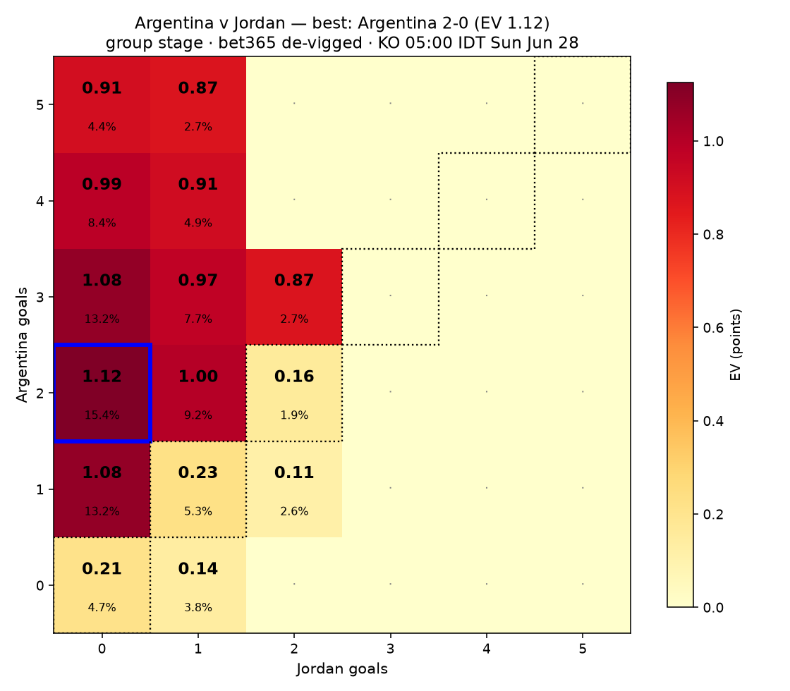

## Summary across all matches

| Match | KO IDT | Best pick | EV | Best draw |
|---|---|---|---|---|
| Norway v France | 22:00 IDT Fri Jun 26 | France 2-1 | 0.820 | 1-1 (EV 0.41) |
| Senegal v Iraq | 22:00 IDT Fri Jun 26 | Senegal 2-0 | 1.065 | 1-1 (EV 0.28) |
| Cape Verde v Saudi Arabia | 03:00 IDT Sat Jun 27 | Cape Verde 1-0 | 0.577 | 1-1 (EV 0.54) |
| Uruguay v Spain | 03:00 IDT Sat Jun 27 | Spain 1-0 | 0.905 | 1-1 (EV 0.42) |
| Egypt v Iran | 06:00 IDT Sat Jun 27 | Egypt 1-0 | 0.660 | 0-0 (EV 0.66) |
| New Zealand v Belgium | 06:00 IDT Sat Jun 27 | Belgium 2-0 | 1.074 | 1-1 (EV 0.24) |
| Panama v England | 00:00 IDT Sun Jun 28 | England 2-0 | 1.086 | 1-1 (EV 0.23) |
| Croatia v Ghana | 00:00 IDT Sun Jun 28 | Croatia 1-0 | 0.830 | 1-1 (EV 0.55) |
| Colombia v Portugal | 02:30 IDT Sun Jun 28 | Portugal 1-0 | 0.777 | 1-1 (EV 0.50) |
| Congo DR v Uzbekistan | 02:30 IDT Sun Jun 28 | Congo DR 1-0 | 0.802 | 1-1 (EV 0.45) |
| Algeria v Austria | 05:00 IDT Sun Jun 28 | Austria 1-1 | 0.818 | 1-1 (EV 0.82) |
| Jordan v Argentina | 05:00 IDT Sun Jun 28 | Argentina 2-0 | 1.125 | 1-1 (EV 0.23) |
