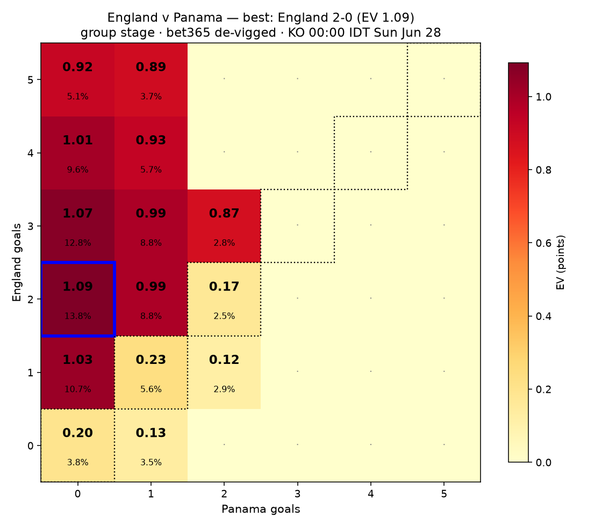
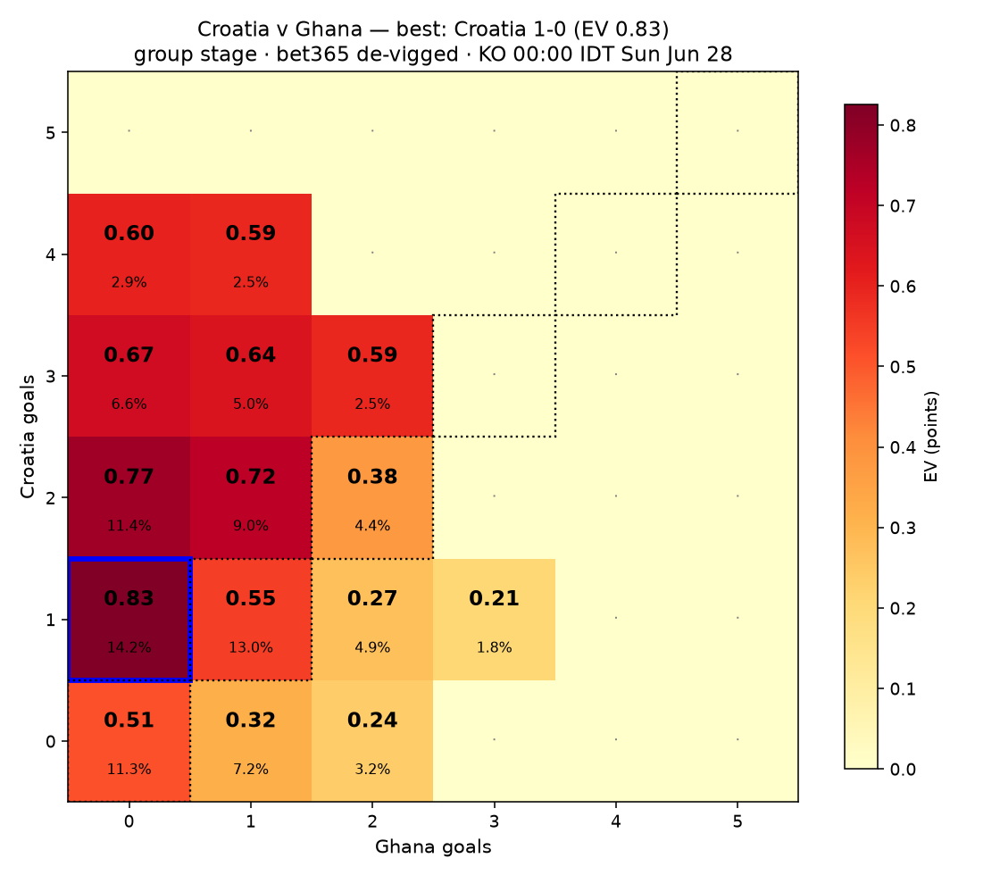
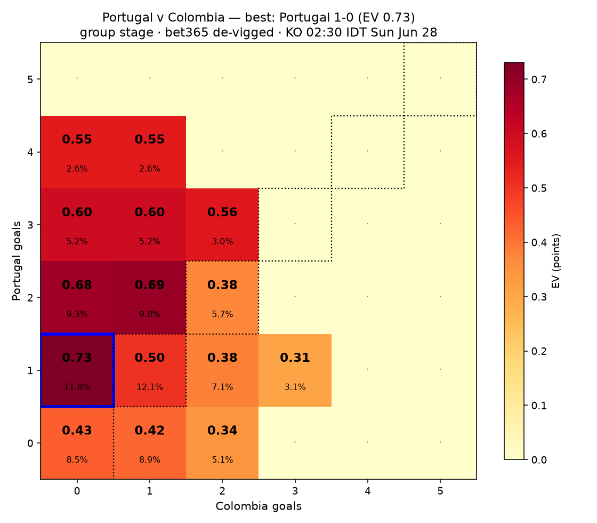
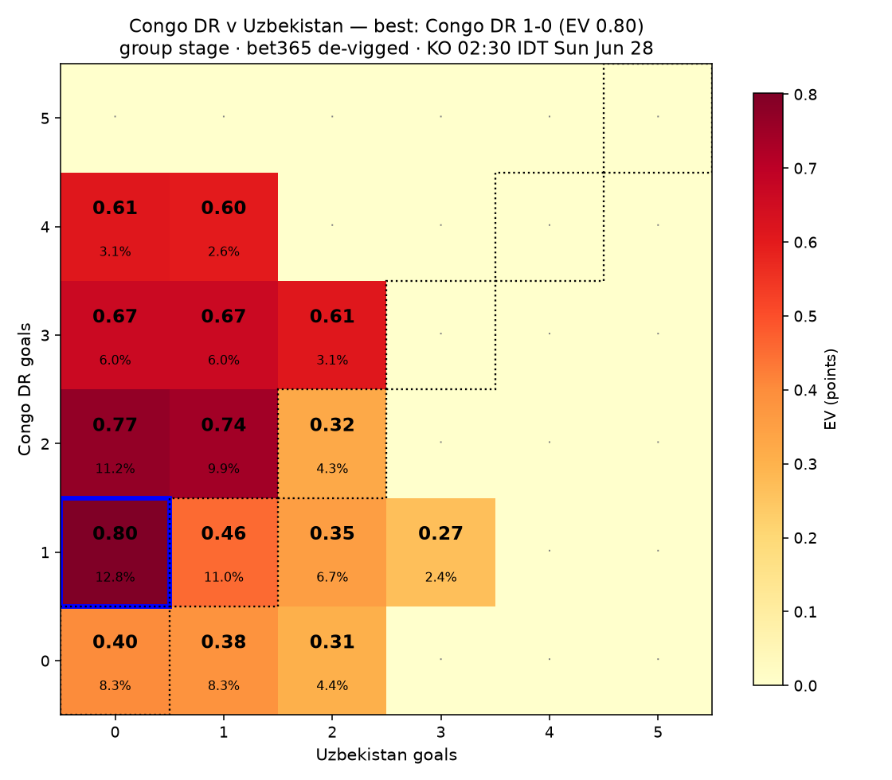
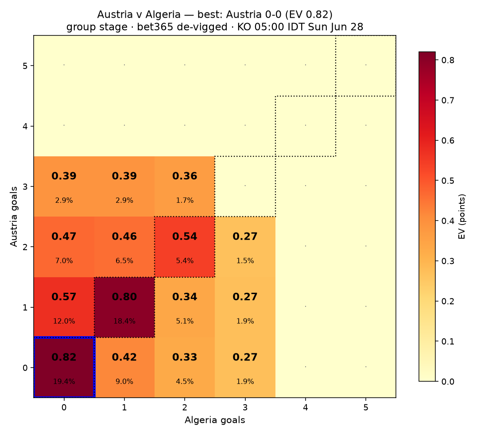
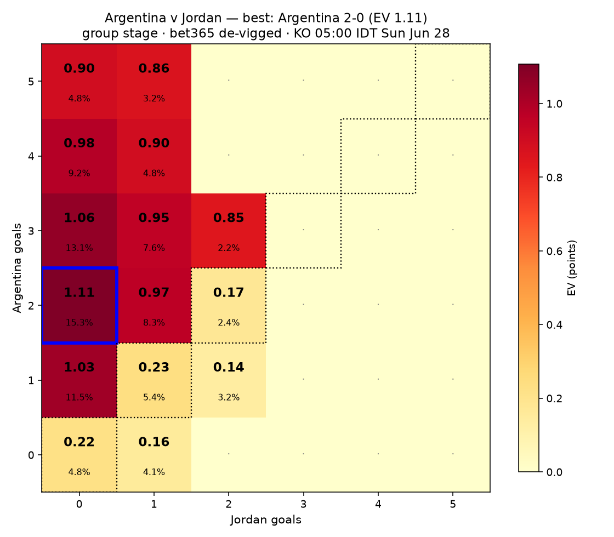
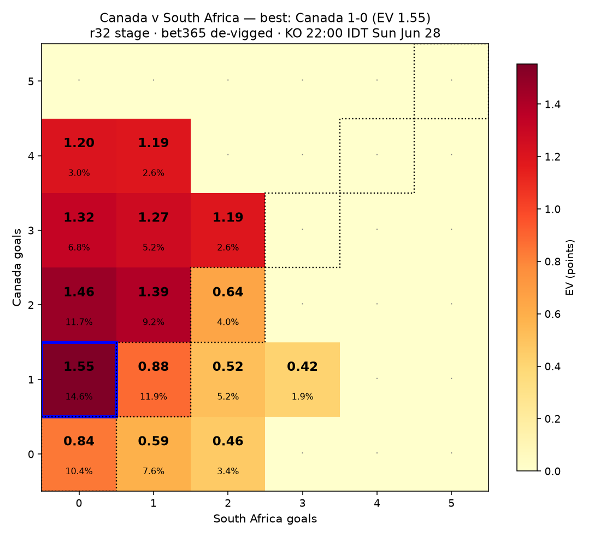

# WC2026 EV picks — 2026-06-27 (IDT, 48h window)

7 upcoming matches in the next 48h (kickoffs Sun Jun 28 00:00 → 22:00 IDT). Matches 1-6 close the group stage; match 7 is the R32 opener. bet365 odds via kickoff.co.uk, de-vigged.

**Scoring:** group → direction 1 / exact 3 → EV = P(class) + 2·P(exact); R32 → direction 2 / exact 5 → EV = 2·P(class) + 3·P(exact).

**Caveat:** bet365 correct-score list is partial (~15 lines, no 'any other score' bucket); de-vigged WITHIN each outcome class from scorelines listed.

## Panama v England — group · KO 00:00 IDT Sun Jun 28

De-vigged 1X2: Panama **6.4%** · Draw **11.9%** · England **81.7%**. Favorite: **England** (win 81.7%).

| Scoreline (fav-dog) | P(exact) | EV |
|---|---|---|
| England 2-0 | 13.75% | 1.092 |
| England 3-0 | 12.84% | 1.074 |
| England 1-0 | 10.70% | 1.031 |
| England 4-0 | 9.63% | 1.009 |
| England 2-1 | 8.75% | 0.992 |
| England 3-1 | 8.75% | 0.992 |

**Best pick:** England 2-0 — EV 1.092 (P 13.75%)  
**Best draw (contrast):** 1-1 — EV 0.231 (P 5.60%)  

## Croatia v Ghana — group · KO 00:00 IDT Sun Jun 28

De-vigged 1X2: Croatia **54.1%** · Draw **28.7%** · Ghana **17.2%**. Favorite: **Croatia** (win 54.1%).

| Scoreline (fav-dog) | P(exact) | EV |
|---|---|---|
| Croatia 1-0 | 14.21% | 0.825 |
| Croatia 2-0 | 11.37% | 0.768 |
| Croatia 2-1 | 8.98% | 0.721 |
| Croatia 3-0 | 6.56% | 0.672 |
| Croatia 3-1 | 5.02% | 0.641 |
| Croatia 4-0 | 2.94% | 0.600 |

**Best pick:** Croatia 1-0 — EV 0.825 (P 14.21%)  
**Best draw (contrast):** 1-1 — EV 0.547 (P 12.99%)  

## Colombia v Portugal — group · KO 02:30 IDT Sun Jun 28

De-vigged 1X2: Colombia **24.2%** · Draw **26.3%** · Portugal **49.5%**. Favorite: **Portugal** (win 49.5%).

| Scoreline (fav-dog) | P(exact) | EV |
|---|---|---|
| Portugal 1-0 | 11.77% | 0.731 |
| Portugal 2-1 | 9.81% | 0.691 |
| Portugal 2-0 | 9.30% | 0.681 |
| Portugal 3-1 | 5.19% | 0.599 |
| Portugal 3-0 | 5.19% | 0.599 |
| Portugal 3-2 | 3.05% | 0.556 |

**Best pick:** Portugal 1-0 — EV 0.731 (P 11.77%)  
**Best draw (contrast):** 1-1 — EV 0.505 (P 12.12%)  

## Congo DR v Uzbekistan — group · KO 02:30 IDT Sun Jun 28

De-vigged 1X2: Congo DR **54.6%** · Draw **23.6%** · Uzbekistan **21.8%**. Favorite: **Congo DR** (win 54.6%).

| Scoreline (fav-dog) | P(exact) | EV |
|---|---|---|
| Congo DR 1-0 | 12.77% | 0.801 |
| Congo DR 2-0 | 11.17% | 0.769 |
| Congo DR 2-1 | 9.93% | 0.744 |
| Congo DR 3-0 | 5.96% | 0.665 |
| Congo DR 3-1 | 5.96% | 0.665 |
| Congo DR 3-2 | 3.08% | 0.607 |

**Best pick:** Congo DR 1-0 — EV 0.801 (P 12.77%)  
**Best draw (contrast):** 1-1 — EV 0.456 (P 11.01%)  

## Algeria v Austria — group · KO 05:00 IDT Sun Jun 28

De-vigged 1X2: Algeria **23.8%** · Draw **43.2%** · Austria **33.0%**. Favorite: **Austria** (win 33.0%).

| Scoreline (fav-dog) | P(exact) | EV |
|---|---|---|
| Austria 0-0 | 19.39% | 0.820 |
| Austria 1-1 | 18.42% | 0.800 |
| Austria 1-0 | 12.04% | 0.571 |
| Austria 2-2 | 5.42% | 0.541 |
| Austria 2-0 | 7.02% | 0.471 |
| Austria 2-1 | 6.48% | 0.460 |

**Best pick:** Austria 0-0 — EV 0.820 (P 19.39%)  
**Best draw (contrast):** 0-0 — EV 0.820 (P 19.39%)  

## Jordan v Argentina — group · KO 05:00 IDT Sun Jun 28

De-vigged 1X2: Jordan **7.3%** · Draw **12.6%** · Argentina **80.1%**. Favorite: **Argentina** (win 80.1%).

| Scoreline (fav-dog) | P(exact) | EV |
|---|---|---|
| Argentina 2-0 | 15.29% | 1.107 |
| Argentina 3-0 | 13.11% | 1.063 |
| Argentina 1-0 | 11.47% | 1.030 |
| Argentina 4-0 | 9.18% | 0.984 |
| Argentina 2-1 | 8.34% | 0.968 |
| Argentina 3-1 | 7.65% | 0.954 |

**Best pick:** Argentina 2-0 — EV 1.107 (P 15.29%)  
**Best draw (contrast):** 1-1 — EV 0.235 (P 5.43%)  

## South Africa v Canada — r32 · KO 22:00 IDT Sun Jun 28

De-vigged 1X2: South Africa **18.0%** · Draw **26.3%** · Canada **55.7%**. Favorite: **Canada** (win 55.7%).

| Scoreline (fav-dog) | P(exact) | EV |
|---|---|---|
| Canada 1-0 | 14.63% | 1.552 |
| Canada 2-0 | 11.70% | 1.465 |
| Canada 2-1 | 9.24% | 1.391 |
| Canada 3-0 | 6.75% | 1.316 |
| Canada 3-1 | 5.16% | 1.268 |
| Canada 4-0 | 3.03% | 1.204 |

**Best pick:** Canada 1-0 — EV 1.552 (P 14.63%)  
**Best draw (contrast):** 1-1 — EV 0.883 (P 11.91%)  

## Summary across all matches

| Match | KO IDT | Best pick | EV | Best draw |
|---|---|---|---|---|
| Panama v England | 00:00 IDT Sun Jun 28 | England 2-0 | 1.092 | 1-1 (EV 0.23) |
| Croatia v Ghana | 00:00 IDT Sun Jun 28 | Croatia 1-0 | 0.825 | 1-1 (EV 0.55) |
| Colombia v Portugal | 02:30 IDT Sun Jun 28 | Portugal 1-0 | 0.731 | 1-1 (EV 0.50) |
| Congo DR v Uzbekistan | 02:30 IDT Sun Jun 28 | Congo DR 1-0 | 0.801 | 1-1 (EV 0.46) |
| Algeria v Austria | 05:00 IDT Sun Jun 28 | Austria 0-0 | 0.820 | 0-0 (EV 0.82) |
| Jordan v Argentina | 05:00 IDT Sun Jun 28 | Argentina 2-0 | 1.107 | 1-1 (EV 0.23) |
| South Africa v Canada | 22:00 IDT Sun Jun 28 | Canada 1-0 | 1.552 | 1-1 (EV 0.88) |
