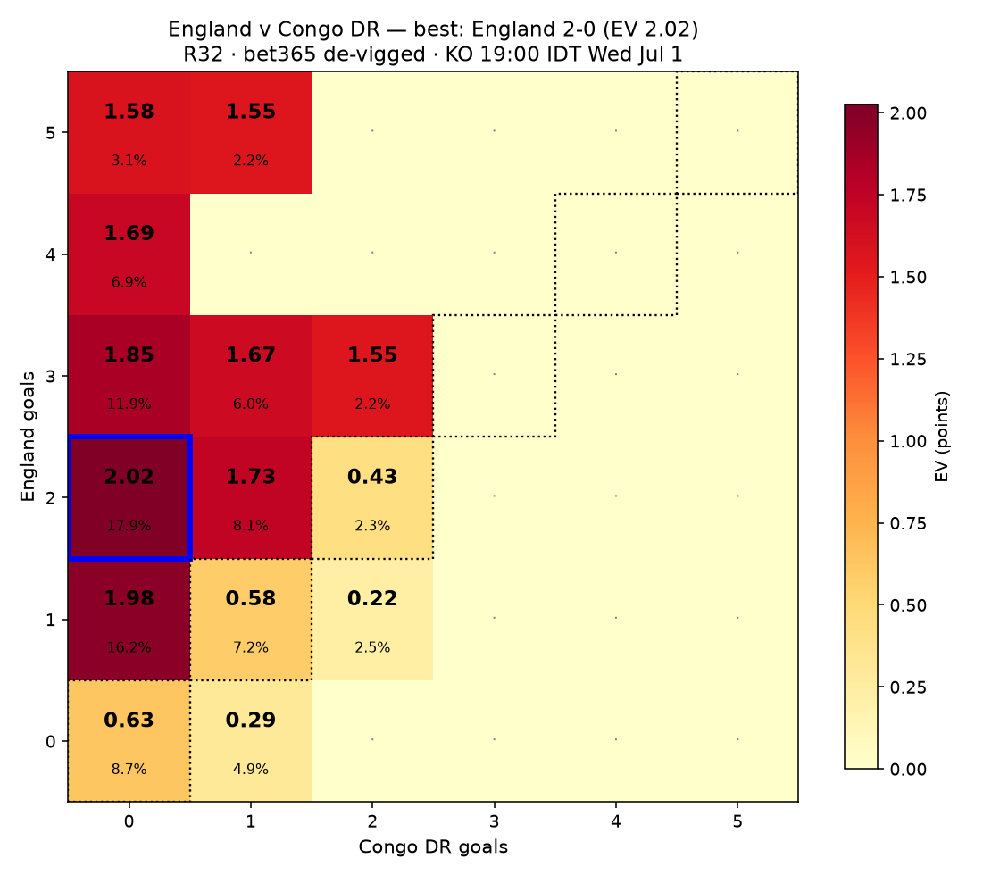
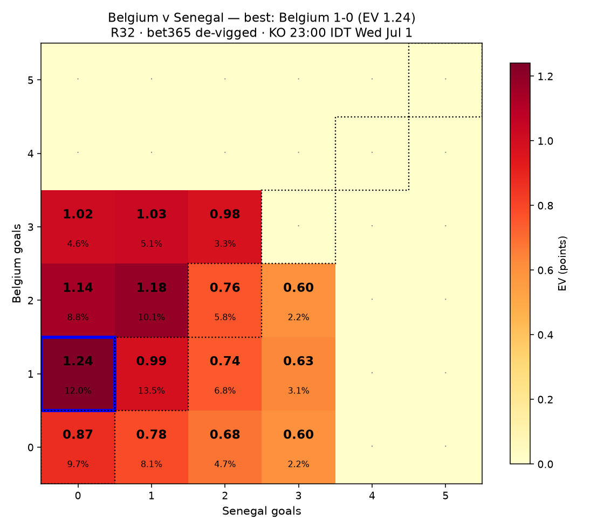
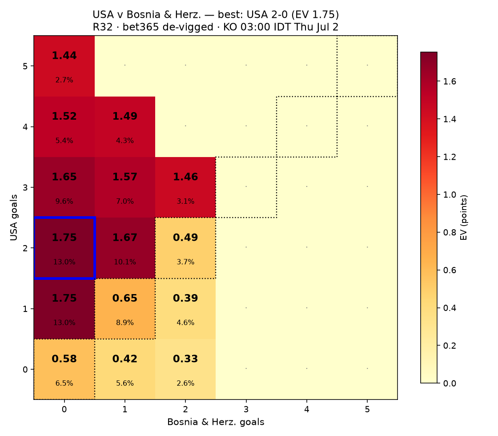
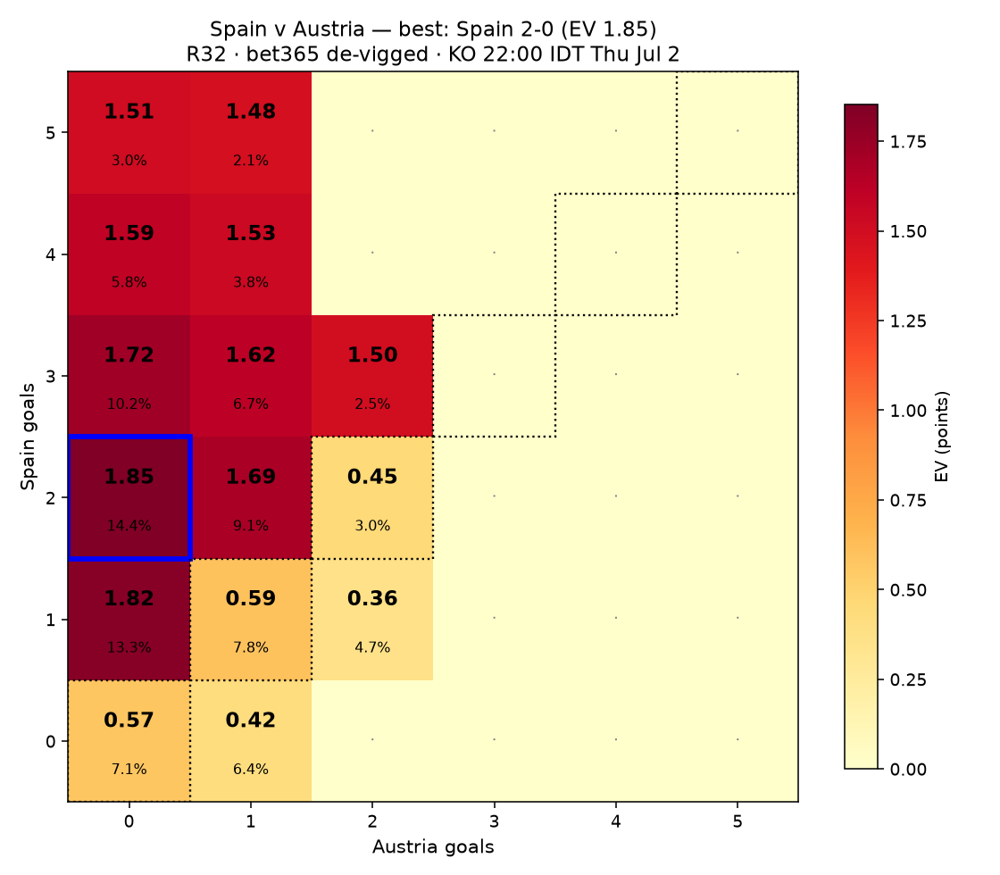
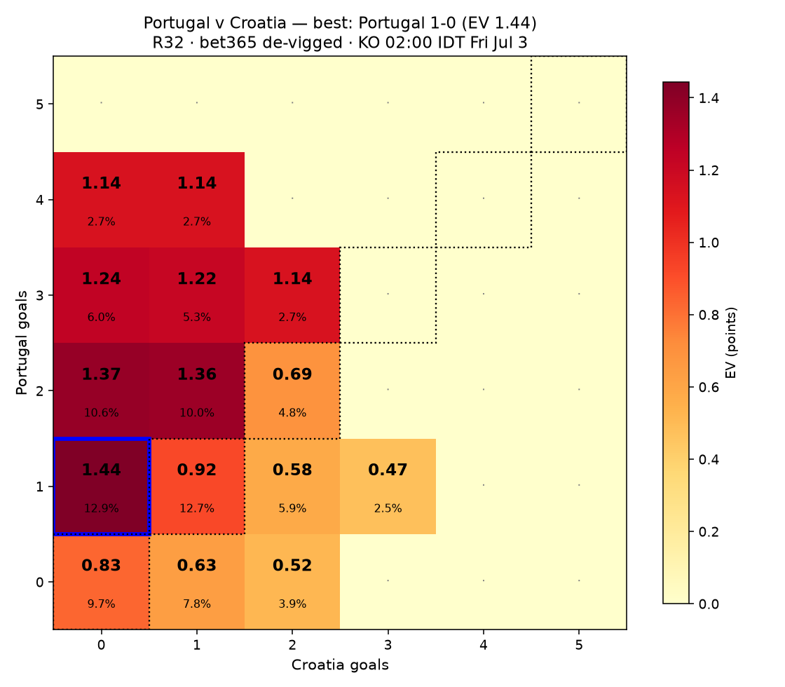
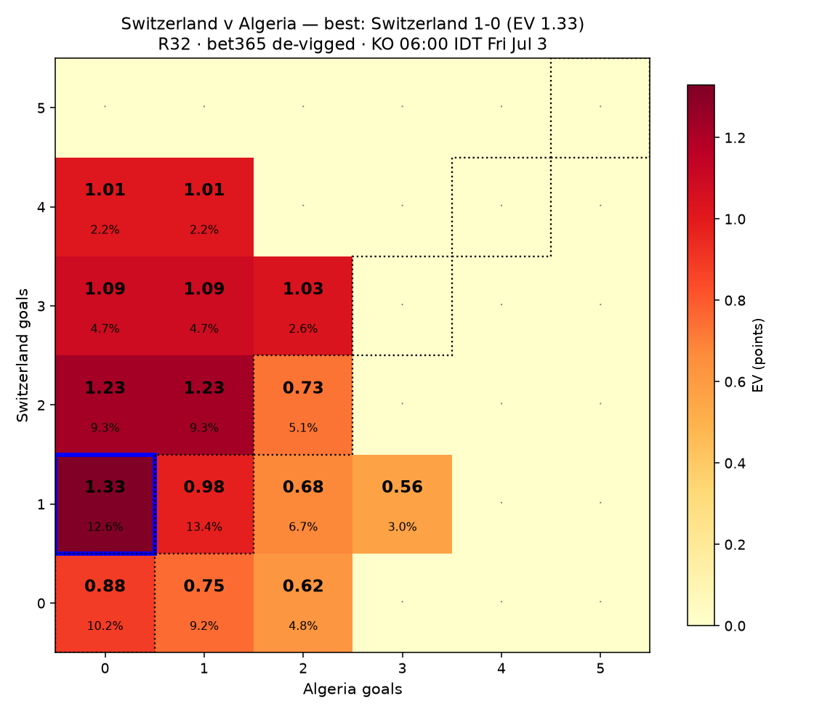

# WC2026 EV picks — 2026-07-01 (IDT, 48h window)

6 upcoming Round-of-32 matches in the next 48h (kickoffs Wed Jul 1 19:00 IDT → Fri Jul 3 06:00 IDT). bet365 odds via kickoff.co.uk, de-vigged.

**Scoring (R32):** direction 2 pts, exact 5 pts → EV = 2·P(class) + 3·P(exact).

**Caveat:** bet365 correct-score list is partial (~15 lines, no 'any other score' bucket); de-vigged WITHIN each outcome class from scorelines listed.

## England v Congo DR — R32 · KO 19:00 IDT Wed Jul 1

De-vigged 1X2: England **74.4%** · Draw **18.2%** · Congo DR **7.4%**. Favorite: **England** (win 74.4%).

| Scoreline (fav-dog) | P(exact) | EV |
|---|---|---|
| England 2-0 | 17.87% | 2.024 |
| England 1-0 | 16.24% | 1.976 |
| England 3-0 | 11.91% | 1.846 |
| England 2-1 | 8.12% | 1.732 |
| England 4-0 | 6.87% | 1.694 |
| England 3-1 | 5.96% | 1.667 |

**Best pick:** England 2-0 — EV 2.024 (P 17.87%)  
**Best draw (contrast):** 0-0 — EV 0.627 (P 8.75%)  

## Belgium v Senegal — R32 · KO 23:00 IDT Wed Jul 1

De-vigged 1X2: Belgium **43.9%** · Draw **29.1%** · Senegal **27.0%**. Favorite: **Belgium** (win 43.9%).

| Scoreline (fav-dog) | P(exact) | EV |
|---|---|---|
| Belgium 1-0 | 12.05% | 1.240 |
| Belgium 2-1 | 10.15% | 1.183 |
| Belgium 2-0 | 8.76% | 1.142 |
| Belgium 3-1 | 5.07% | 1.031 |
| Belgium 3-0 | 4.59% | 1.016 |
| Belgium 1-1 | 13.49% | 0.986 |

**Best pick:** Belgium 1-0 — EV 1.240 (P 12.05%)  
**Best draw (contrast):** 1-1 — EV 0.986 (P 13.49%)  

## USA v Bosnia & Herz. — R32 · KO 03:00 IDT Thu Jul 2

De-vigged 1X2: USA **68.2%** · Draw **19.1%** · Bosnia & Herz. **12.7%**. Favorite: **USA** (win 68.2%).

| Scoreline (fav-dog) | P(exact) | EV |
|---|---|---|
| USA 2-0 | 13.00% | 1.754 |
| USA 1-0 | 13.00% | 1.754 |
| USA 2-1 | 10.11% | 1.667 |
| USA 3-0 | 9.58% | 1.651 |
| USA 3-1 | 7.00% | 1.574 |
| USA 4-0 | 5.35% | 1.524 |

**Best pick:** USA 2-0 — EV 1.754 (P 13.00%)  
**Best draw (contrast):** 1-1 — EV 0.649 (P 8.91%)  

## Spain v Austria — R32 · KO 22:00 IDT Thu Jul 2

De-vigged 1X2: Spain **70.9%** · Draw **18.0%** · Austria **11.1%**. Favorite: **Spain** (win 70.9%).

| Scoreline (fav-dog) | P(exact) | EV |
|---|---|---|
| Spain 2-0 | 14.44% | 1.852 |
| Spain 1-0 | 13.33% | 1.818 |
| Spain 3-0 | 10.19% | 1.724 |
| Spain 2-1 | 9.12% | 1.692 |
| Spain 3-1 | 6.66% | 1.619 |
| Spain 4-0 | 5.78% | 1.592 |

**Best pick:** Spain 2-0 — EV 1.852 (P 14.44%)  
**Best draw (contrast):** 1-1 — EV 0.594 (P 7.83%)  

## Portugal v Croatia — R32 · KO 02:00 IDT Fri Jul 3

De-vigged 1X2: Portugal **52.8%** · Draw **27.2%** · Croatia **20.0%**. Favorite: **Portugal** (win 52.8%).

| Scoreline (fav-dog) | P(exact) | EV |
|---|---|---|
| Portugal 1-0 | 12.89% | 1.443 |
| Portugal 2-0 | 10.62% | 1.375 |
| Portugal 2-1 | 10.03% | 1.357 |
| Portugal 3-0 | 6.02% | 1.237 |
| Portugal 3-1 | 5.31% | 1.216 |
| Portugal 3-2 | 2.65% | 1.136 |

**Best pick:** Portugal 1-0 — EV 1.443 (P 12.89%)  
**Best draw (contrast):** 1-1 — EV 0.923 (P 12.65%)  

## Switzerland v Algeria — R32 · KO 06:00 IDT Fri Jul 3

De-vigged 1X2: Switzerland **47.5%** · Draw **28.8%** · Algeria **23.7%**. Favorite: **Switzerland** (win 47.5%).

| Scoreline (fav-dog) | P(exact) | EV |
|---|---|---|
| Switzerland 1-0 | 12.64% | 1.329 |
| Switzerland 2-0 | 9.31% | 1.229 |
| Switzerland 2-1 | 9.31% | 1.229 |
| Switzerland 3-0 | 4.66% | 1.089 |
| Switzerland 3-1 | 4.66% | 1.089 |
| Switzerland 3-2 | 2.60% | 1.028 |

**Best pick:** Switzerland 1-0 — EV 1.329 (P 12.64%)  
**Best draw (contrast):** 1-1 — EV 0.978 (P 13.40%)  

## Summary across all matches

| Match | KO IDT | Best pick | EV | Best draw |
|---|---|---|---|---|
| England v Congo DR | 19:00 IDT Wed Jul 1 | England 2-0 | 2.024 | 0-0 (EV 0.63) |
| Belgium v Senegal | 23:00 IDT Wed Jul 1 | Belgium 1-0 | 1.240 | 1-1 (EV 0.99) |
| USA v Bosnia & Herz. | 03:00 IDT Thu Jul 2 | USA 2-0 | 1.754 | 1-1 (EV 0.65) |
| Spain v Austria | 22:00 IDT Thu Jul 2 | Spain 2-0 | 1.852 | 1-1 (EV 0.59) |
| Portugal v Croatia | 02:00 IDT Fri Jul 3 | Portugal 1-0 | 1.443 | 1-1 (EV 0.92) |
| Switzerland v Algeria | 06:00 IDT Fri Jul 3 | Switzerland 1-0 | 1.329 | 1-1 (EV 0.98) |
